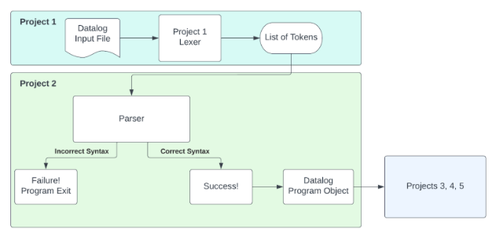
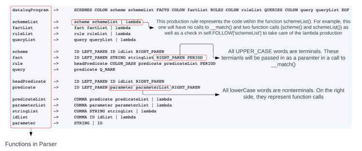
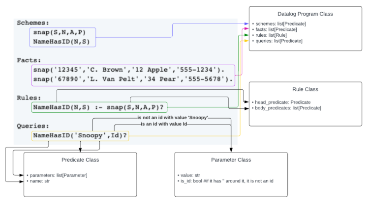

# Parsing Datalog

In this project, you will build a parser for datalog. In project 1, you built a lexer to convert Datalog text into tokens. The parser will use those tokens along with a Datalog grammar and recursive descent parsing to verify that the input has correct Datalog syntax. Along with the parser, you will also build a Datalog program data structure in preparation for Projects 3 and 4. Here is the big picture:

<p align="center">

</p>

Parsing actually does two related tasks:

1. Determine if a Datalog programs is _syntactically correct_
1. Determine if a Datalog program is _semantically correct_

The first task is accomplished by checking that there exists a derivation of the Datalog grammar that matches the token stream generated by the input Datalog program. The second task is accomplished by building a data structure for a Datalog program and making sure that the stated facts, rules, and queries all reference known, and defined schemes. A def-use property such as this, a fact belongs to a defined scheme, is a semantic property of the program, and these properties are checked using a data structure to represent a Datalog program. See [CODE.md](CODE.md) to learn more about the `DatalogProgram` data structure you are required to use for this project.

## Datalog Grammar

A Datalog program is syntactically correct if there exists a derivation of the Datalog grammar that matches the token stream created by the Datalog program input. Finding a derivation for this project is done with a _recursive descent parser using FIRST and FOLLOW sets_. The token stream for the parser comes from the lexer in Project 0.

The Datalog grammar is below. The non-terminals in the grammar begin with a lower-case letter. Terminal symbols in the grammar are written in all upper-case letters. The word 'lambda' in the grammar represents the empty string.

Note that comments do not appear in the grammar because comments should be ignored by adding the `COMMENT` token to hidden. See the example in `lexer.py` where the `WHITESPACE` token is added to hidden.

```
datalogProgram  ->  SCHEMES COLON scheme schemeList FACTS COLON factList RULES COLON ruleList QUERIES COLON query queryList EOF

schemeList  ->  scheme schemeList | lambda
factList    ->  fact factList | lambda
ruleList    ->  rule ruleList | lambda
queryList   ->  query queryList | lambda

scheme      ->  ID LEFT_PAREN ID idList RIGHT_PAREN
fact        ->  ID LEFT_PAREN STRING stringList RIGHT_PAREN PERIOD
rule        ->  headPredicate COLON_DASH predicate predicateList PERIOD
query           ->      predicate Q_MARK

headPredicate   ->  ID LEFT_PAREN ID idList RIGHT_PAREN
predicate   ->  ID LEFT_PAREN parameter parameterList RIGHT_PAREN

predicateList   ->  COMMA predicate predicateList | lambda
parameterList   ->  COMMA parameter parameterList | lambda
stringList  ->  COMMA STRING stringList | lambda
idList      ->  COMMA ID idList | lambda
parameter   ->  STRING | ID
```

The below diagram represents where the different pieces of the grammar go in the `datalog_program` parser. See [Recursive descent parsing with FIRST sets](Recursive_descent_parsing_code_example_2024.ipynb) and [Recursive descent parsing with FOLLOW sets](Recursive_descent_parsing_code_with_FOLLOW_example_2024.ipynb) Jupyter Notebooks for more on how to map grammar rules to the recursive descent parser.

<p align="center">

</p>

# Datalog Program Data Structures

A Datalog program consists of lists of schemes, facts, rules and queries. Use Python's built in list functionality. Please do not write your own list class.

You need to store the information for the schemes, facts, rules, and queries in the lists. Because schemes, facts, and queries all have the same form as predicates, the `Predicate` class can be used to represent all of these types of objects. You don't need classes named `Scheme`, `Fact`, and `Query`. Schemes, facts, and queries can (and should) be stored in `Predicate` objects. You will find the `Rule` class helpful to store the head predicate (the left-hand side of the colon-dash) and a list for the body predicates (the right-hand side of the colon-dash). All the schemes, facts, rules, and queries are stored in the `DatalogProgram` class. See [CODE.md](CODE.md) for details.

This diagram may be helpful in understanding the data structures.

<p align="center">

</p>

# Output Format

The starter code already includes what is needed for the parser output. If the parse is successful, it outpus 'Success!' followed by the lists of schemes, facts, rules, queries in the resulting `DatalogProgram` instance. The output includes the number of items in each list as shown in the example output below. The schemes, facts, rules, and queries appear in the same order in which they appear in the input.

The starter code also outputs the set of the domain values that appear in the Datalog program. The domain values are the strings (surrounded by quotes) that appear in the facts. Note that strings that only appear in the rules or queries sections are not part of the domain. The domain only includes strings found in the facts section. The domain is a set of strings so there are no duplicates. The domain strings appear in sorted order.

## Example Input

```
Schemes:
  snap(S,N,A,P)
  HasSameAddress(X,Y)

Facts:
  snap('12345','C. Brown','12 Apple','555-1234').
  snap('33333','Snoopy','12 Apple','555-1234').

Rules:
  HasSameAddress(X,Y) :- snap(A,X,B,C),snap(D,Y,B,E).

Queries:
  HasSameAddress('Snoopy',Who)?
```

## Example Output

```
Success!
Schemes(2):
  snap(S,N,A,P)
  HasSameAddress(X,Y)
Facts(2):
  snap('12345','C. Brown','12 Apple','555-1234').
  snap('33333','Snoopy','12 Apple','555-1234').
Rules(1):
  HasSameAddress(X,Y) :- snap(A,X,B,C),snap(D,Y,B,E).
Queries(1):
  HasSameAddress('Snoopy',Who)?
Domain(6):
  '12 Apple'
  '12345'
  '33333'
  '555-1234'
  'C. Brown'
  'Snoopy'
```

# Syntax Errors

If the parse is unsuccessful, the code outputs `Failure!` followed by the offending token with its type, value, and line number. The parser stops after encountering the first offending token.

## Example Input

```
Schemes:
    snap(S,N,A,P)
    NameHasID(N,S)

Facts:
    snap('12345','C. Brown','12 Apple','555-1234').
    snap('67890','L. Van Pelt','34 Pear','555-5678').

Rules:
    NameHasID(N,S) :- snap(S,N,A,P)?

Queries:
    NameHasID('Snoopy',Id)?
```

## Example Output

```
Failure!
  (Q_MARK,"?",10)
```
